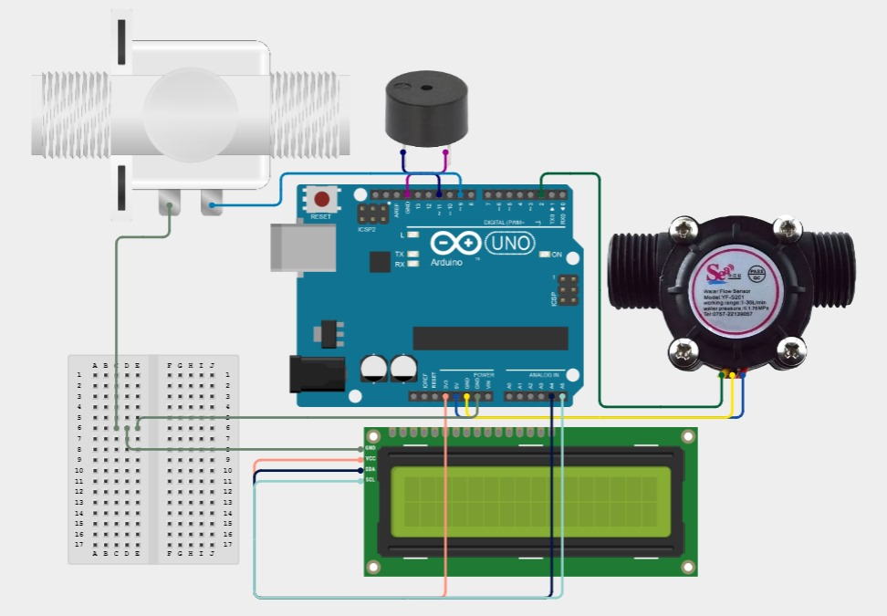

# Water Flow Meter with LCD Display 💧📊

This project implements a **Water Flow Meter** using an **Arduino** board, **Hall-effect flow sensor**, **LCD display**, and a **buzzer**. The system measures the flow rate of water in milliliters per second (mL/s) and displays it on an LCD. Additionally, it tracks the cumulative flow and triggers a buzzer if the set volume limit is exceeded.

## Features:
- **Real-time Flow Measurement**: Measures the water flow in mL/s using the Hall-effect flow sensor.
- **Volume Tracking**: Keeps track of the total water quantity passed through the sensor.
- **LCD Display**: Displays flow rate and cumulative total of water in milliliters on a 16x2 LCD.
- **Limit Setting**: Allows the user to set a limit for the total volume (in mL). If the limit is exceeded, a buzzer is triggered.
- **Buzzer Alert**: Activates the buzzer when the total flow exceeds the user-defined limit.
  
## Components:
- **Arduino Uno/Nano** (or compatible)
- **Hall-effect Water Flow Sensor** (used to measure water flow)
- **LCD 16x2 Display with I2C interface** (for displaying the flow rate and total water volume)
- **Buzzer** (for alert when limit is exceeded)
- **Wires, breadboard** (for connections)
- 

## Libraries Used:
- **Wire.h**: For I2C communication with the LCD display.
- **LiquidCrystal_I2C.h**: For controlling the LCD display over I2C.

## How It Works:
1. **Flow Measurement**: The flow sensor generates pulses that correspond to the volume of water passing through. These pulses are counted by the Arduino.
2. **Flow Rate Calculation**: The flow rate is calculated based on the number of pulses per second and the sensor's calibration factor.
3. **Display**: The calculated flow rate and total volume are displayed on the LCD.
4. **Limit Setting**: The user can set a volume limit through the Serial Monitor. Once the total volume exceeds the limit, the buzzer is triggered to alert the user.

## Code Explanation:
- **pulseCounter()**: An interrupt service routine that increments the pulse count whenever the sensor sends a pulse.
- **Flow Rate Calculation**: The flow rate is calculated in liters per minute (L/min) and converted into milliliters per second (mL/s).
- **LCD Display**: The flow rate and total volume are displayed on the LCD. If the total volume exceeds the limit, the message "OVERUSE" is displayed.

## How to Use:
1. **Connect Components**: Connect the water flow sensor, LCD display, and buzzer to the Arduino as described in the code comments.
2. **Upload the Code**: Use the Arduino IDE to upload the code to your Arduino.
3. **Set Limit**: Open the Serial Monitor and enter a volume limit (in mL) when prompted.
4. **Monitor Flow**: Watch the flow rate and total volume on the LCD. If the total volume exceeds the set limit, the buzzer will sound.

## Future Improvements:
- Implement more precise flow calibration based on real-world tests.
- Add wireless notifications using **Wi-Fi/Bluetooth** when the volume exceeds the limit.
- Display additional information such as flow rate trends or averages over time.
